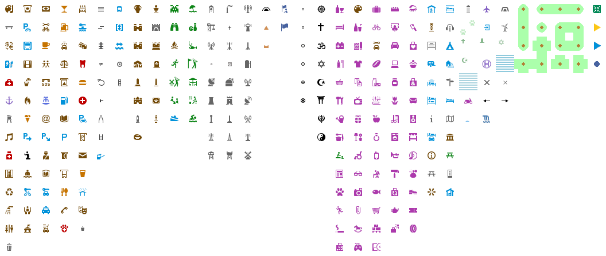

# rC3-OSM-Tileset

This is a tileset based on the [OpenStreetMap Carto](https://github.com/gravitystorm/openstreetmap-carto) map style which is for example used on [openstreetmap.org](https://www.openstreetmap.org/). It was created with the intention to be able to use it in a [WorkAdventure](https://workadventu.re/)-based world at [rC3](https://rc3.world/).

## Tilesets

### Building

`building.png`: Some building elements and entrances.

### Colours

`colours.png`: Plain colours to mark special tiles on special tile layers like walls, entrances, exits, links, etc.

### Highway

`highway.png`: Roads, footways, train tracks, etc.

### Landcover 256

`landcover_256.png`: Landcover tiles to put on the background based on 256x256px "symbols" from OpenStreetMap Carto.

### Landcover 512

`landcover_512.png`: Landcover tiles to put on the background based on 256x256px "symbols" from OpenStreetMap Carto.

### Landuse

`landuse.png`: Landuse colours for the background.

### Symbols

`symbols.png`: Various symbols from OpenStreetMap Carto, tiles created using the script in `bin/symbols-to-tilesets` from the original SVG and PNG files.

## Tools

The `bin` directory contains some potentially useful scripts:

### `label-generator`

This script can be used to generate labels for maps based on this tileset. On Debian (and likely various other distributions that are based on Debian, like Ubuntu), the runtime dependencies can be installed with a command like the following one:

        sudo apt-get install libimage-librsvg-perl libimage-magick-perl \
            libmoose-perl libmoosex-getopt-perl libmoosex-types-path-class-perl \
            libreadonly-perl libxml-libxml-perl fonts-noto-core fonts-noto-ui-core

Called without parameters, the script will show some documentation and can be used as follows to generate simple labels:

        ./bin/label-generator --target-file my-shop.png --color shop --text 'My nice little shop'

When creating multiple labels that should be used on a map, it's probably best to collect them in their own tileset that could be built with e.g. [Krita](https://krita.org/) using file layers that reference the generated label files. This prevents one from having to add lots of tilesets to the Tiled project.

### `symbols-to-tilesets`

This script was used to generate the PNG files that are based on the [OpenStreetMap Carto](https://github.com/gravitystorm/openstreetmap-carto) symbols.

## License

[CC0 1.0 Universal](https://creativecommons.org/publicdomain/zero/1.0/)
